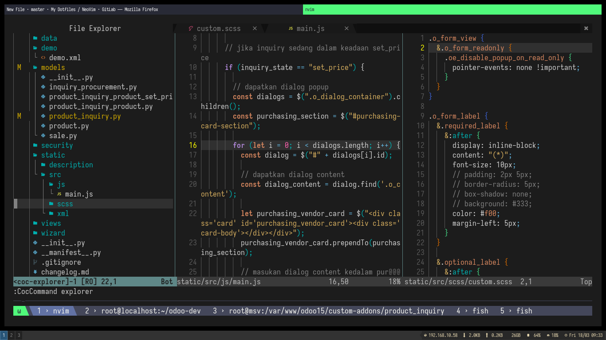

# NeoVim As IDE with me

the main goal of this project is to make it easier for vscode users to migrate to neovim as a day-to-day IDE using best of neovim plugin https://github.com/neoclide/coc.nvim



## Install

- need to install git, nodejs, neovim > 0.5
- just clone this repo

```bash
git clone https://gitlab.com/hantamkoding-dotfiles/neovim.git ~/.config/nvim
```

- and run neovim, and viola

## Docs

### Shortcuts

Some of the shortcuts I use frequently are listed here. In the following shortcuts, `<leader>` represents ASCII character `,`.

| Shortcut                          | Mode   | Description                                                                         |
| --------------------------------- | ------ | ----------------------------------------------------------------------------------- |
| `<ctrl>p`                         | Normal | Fuzzy file searching in a floating window                                           |
| `<ctrl>n`                         | Normal | Open sidebar file explorer                                                          |
| `<ctrl>t`                         | Normal | New file                                                                            |
| `<ctrl>PageDown` / `<ctrl>PageUp` | Normal | Change tab to next and prev                                                         |
| `<space>bd`                       | Normal | Close Buffer / File                                                                 |
| `<alt>i` / `F1` / `F2`            | Normal | Toogle floating terminal                                                            |
| `<space>coc`                      | Normal | Open coc helpers list with FZF                                                      |
| `<space>P`                        | Normal | Open list of coc commands                                                           |
| `F8`                              | Normal | Toogle sidebar tags explorer                                                        |
| `<space>rr`                       | Normal | Run current file by [code_runner.nvim](https://github.com/CRAG666/code_runner.nvim) |
